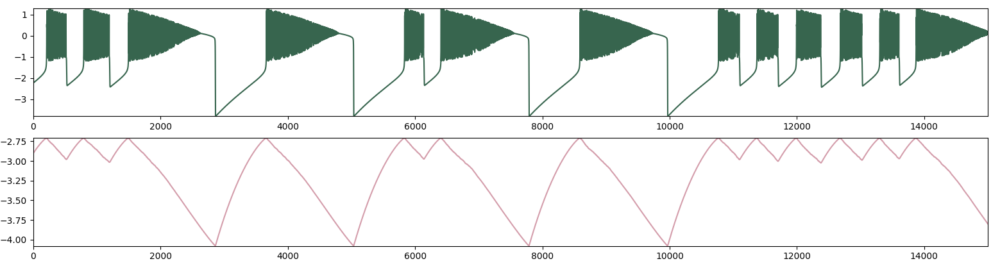

# Simulación de neurona de Rulkov
## Equación del modelo de Rulkov
<figure><figcaption align="center"><b>Eq.1 - La variable x describe procesos rapidos en la neurona como los cambios de tension en la membrana. La variable y describe los procesos lentos en la neurona como la apertura y cerrado de canales ionicos.</b> </figcaption></figure>
 
<figure><figcaption align="center"><b>Fig.1 - Renderización de un tren de spikes generado por la variable rápida y lenta del modelo. Parámetros utilizados: α = 4, β = 0.001, σ = 0.001</b> </figcaption></figure>
 
<figure>
  <table style="display: block; margin-left: auto;margin-right: auto;">
    <tr>
      <th>α</th>
      <th>β</th>
      <th>σ</th>
      <th>X0</th>
      <th>Y0</th>
      <th>N</th>
      <th>Observacion</th>
    </tr>
    <tr>
      <td>4</td>
      <td>0.001</td>
      <td>0.001</td>
      <td>-2</td>
      <td>-3</td>
      <td>10^6</td>
      <td>Burst cortos de 1-10 con un disparo largo final, se simulo 10^6 y no cambio este comportamiento</td>
    </tr>
    <tr>
      <td>>4</td>
      <td>0.001</td>
      <td>0.001</td>
      <td>-2</td>
      <td>-3</td>
      <td>5000</td>
      <td>A medida que se aumenta el alpha los burst se hacen mas cortos y mas periodicos hasta que se asemejan a un continuo</td>
    </tr>
    <tr>
      <td><4</td>
      <td>0.001</td>
      <td>0.001</td>
      <td>-2</td>
      <td>-3</td>
      <td>5000</td>
      <td>Los burst se hacen periodicos y el disparo final se alarga y se achica su ringing, luego se hace cada vez mas corto y luego la ecuacion rapida queda constante en aprox -1</td>
    </tr>
    <tr>
      <td>4</td>
      <td>>0.001</td>
      <td>0.001</td>
      <td>-2</td>
      <td>-3</td>
      <td>5000</td>
      <td>Lentamente acorta los burst cortos hasta 0.0016 donde ambas ecuaciones quedan constantes</td>
    </tr>
    <tr>
      <td>4</td>
      <td><0.001</td>
      <td>0.001</td>
      <td>-2</td>
      <td>-3</td>
      <td>5000</td>
      <td>Alarga los burst largos hasta que queda un solo burst largo por siempre continuo</td>
    </tr>
    <tr>
      <td>4</td>
      <td>0.001</td>
      <td>>0.001</td>
      <td>-2</td>
      <td>-3</td>
      <td>5000</td>
      <td>Alarga los burst largos hasta que queda un solo burst largo por siempre ruidoso</td>
    </tr>
    <tr>
      <td>4</td>
      <td>0.001</td>
      <td><0.001</td>
      <td>-2</td>
      <td>-3</td>
      <td>5000</td>
      <td>Alarga los burst largos hasta que queda un solo burst largo por siempre ruidoso hasta 0.00064 donde luego camia a valores constantes divergentes</td>
    </tr>
    <tr>
      <td>4</td>
      <td>0.001</td>
      <td>0.001</td>
      <td><>-2</td>
      <td>-3</td>
      <td>5000</td>
      <td>Se adapta rapido y continua normalmente</td>
    </tr>
    <tr>
      <td>4</td>
      <td>0.001</td>
      <td>0.001</td>
      <td>-2</td>
      <td><>-3</td>
      <td>5000</td>
      <td>Tiene una zona transiente mayor que al ajustar x0</td>
    </tr>
  </table>
<figcaption align="center"><b>Table.1 - Observaciones de los resultados al variar los parameros de la simulación</b>
</figcaption>
</figure>
 