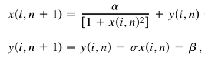
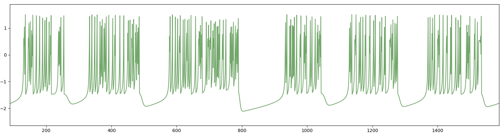

# Simulación de neurona de Rulkov
## Equación del modelo de Rulkov
<figure><figcaption align="center"><b>Eq.1 - La variable x describe procesos rapidos en la neurona como los cambios de tension en la membrana. La variable y describe los procesos lentos en la neurona como la apertura y cerrado de canales ionicos.</b> </figcaption></figure>
 
<figure><figcaption align="center"><b>Fig.1 - Renderización de un tren de spikes generado por la variable rápida del modelo</b> </figcaption></figure>
 
<figure><figcaption align="center"><b>Fig.1 - Renderización de un tren de spikes generado por la variable rápida del modelo</b> </figcaption></figure>