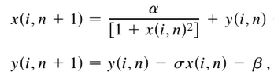

# Simulación de neurona de Rulkov
## Equación del modelo de Rulkov
<figure><figcaption align="center"><b>Eq.1 - x es la variable rápida que describe procesos rapidos en la neurona como los cambios de tension en la membrana. y es la variable lenta que describe los procesos lentos en la neurona como la apertura y cerrado de canales ionicos.</b> </figcaption></figure>